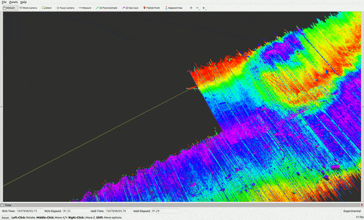
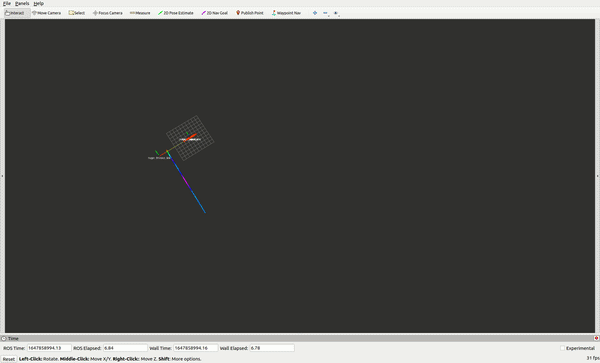
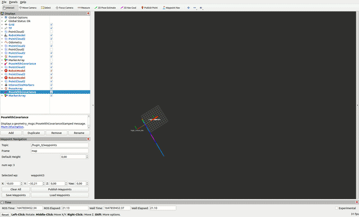
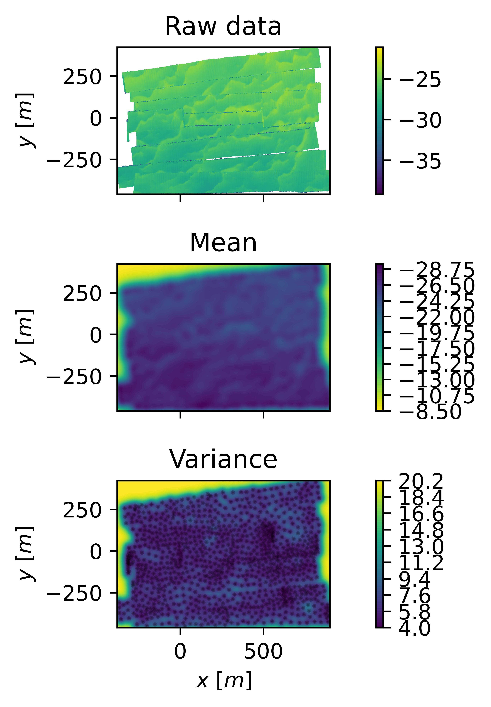

# AUV Exploration

Collection of ROS packages for localization, map building and SLAM with autonomous underwater vehicles and sonar sensors.

## Dependencies (tested on Ubuntu 20.04)
* ROS Noetic
* AUVLIB [here](https://github.com/nilsbore/auvlib) And set the same cmake flags required for Ubuntu 18.
* Bathymetric SLAM [here](https://github.com/ignaciotb/bathymetric_slam)
* GTSAM [here](https://github.com/borglab/gtsam)

```
sudo apt install python3-pygame python3-scipy python3-configargparse python3-numpy
pip install configargparse pygame 
```
Make sure your scipy version is >= 1.4.0

If you're going to be working with Gaussian Processes maps, also install
* Pytorch [here](https://pytorch.org/)
```
pip install gpytorch open3d 
```
If you want to try waypoint navigation for an AUV, clone this repo within your catkin workspace to plan missions in RVIZ
* Waypoint_navigation_plugin [here](https://github.com/KumarRobotics/waypoint_navigation_plugin)

## Building
This is a collection of ROS packages. Just clone the repo within your catking workspace and run
```
rosdep install --from-paths catkin_ws --ignore-src --rosdistro=$ROS_DISTRO -y
catkin_make -DCMAKE_BUILD_TYPE=Release install
```
## Troubleshooting
If you experience errors with GTSAM libraries not being found, add this line at the end of your .bashrc

    export LD_LIBRARY_PATH=$LD_LIBRARY_PATH:/usr/local/lib

## Paper introducing the framework
[Paper](https://arxiv.org/abs/2203.10893)
If you find the repo and the methods useful, please cite us.
```
@article{torroba2022fully,
  title={Fully-probabilistic Terrain Modelling with Stochastic Variational Gaussian Process Maps},
  author={Torroba, Ignacio and Illife Sprague, Christopher and Folkesson, John},
  journal={arXiv e-prints},
  pages={arXiv--2203},
  year={2022}
}
```

## Demos
We provide a dataset collected with a hull-mounted MBES on a ship for example demos. However the code will need to be tuned for applications in different setups (bathymetry, sensors, vehicle and so on).

### Basic demo with one AUV
Reproduce a real bathymetric survey (gt):



```
roslaunch auv_model auv_environment.launch namespace:=hugin_0 mode:=gt start_mission_ping_num:=0
roslaunch auv_model auv_env_aux.launch
```
You should see in RVIZ the AUV and the MBES pings.

Simulate a bathymetric survey (sim):



```
roslaunch auv_model auv_environment.launch namespace:=hugin_0 mode:=sim
roslaunch auv_model auv_env_aux.launch
roslaunch basic_navigation basic_mission.launch manual_control:=True namespace:=hugin_0
```
The last command provides an interface to run the AUV manually with the keyboard (w=forward, s=backward a,d=+/-yaw, up,down=+/-pitch)

### Waypoint navigation with one AUV
Alternatively, to plan and execute autonomous waypoint navigation missions in simulation, install [this package](https://github.com/KumarRobotics/waypoint_navigation_plugin).



```
roslaunch basic_navigation basic_mission.launch manual_control:=False namespace:=hugin_0
```
And add and publish waypoints through RVIZ as in their tutorial.

### Manual navigation with multiple AUVs
Example of multi-agent mission with 2 AUVs:
```
roslaunch auv_model auv_environment.launch namespace:=hugin_0
roslaunch auv_model auv_model.launch namespace:=hugin_1 y:=10
roslaunch auv_model auv_env_aux.launch
roslaunch basic_navigation basic_mission.launch manual_control:=True namespace:=hugin_0
roslaunch basic_navigation basic_mission.launch manual_control:=True namespace:=hugin_1
```
*WP navigation isn't implemented yet for several AUVs and currently you'll need a manual controller per AUV, although this is easy to modify in the launch if required.

### Particle filter localization with an AUV
Replay the AUV bathymetric survey with a PF running on a mesh or a Gaussian process created from the bathymetry.
Set "gp_meas_model==True" for the GP map, otherwise the PF measurement model will be based on raytracing over the mesh.

Note that you'll have to tune the filter parameters in 'auv_pf.launch' for your own application. The terrain provided in this demo is very challenging for localization.


```
roslaunch auv_particle_filter auv_pf.launch namespace:=hugin_0 mode:=gt start_mission_ping_num:=0
roslaunch auv_model auv_env_aux.launch
```

### Simulate particle filter localization with two AUVs
Check 'auv_pf.launch' for the main filter parameters
```
roslaunch auv_particle_filter auv_pf.launch namespace:=hugin_0 x:=-300 y:=-400
roslaunch auv_particle_filter auv_pf.launch namespace:=hugin_1 x:=-330 y:=-430
roslaunch auv_model auv_env_aux.launch
roslaunch basic_navigation basic_mission.launch manual_control:=True namespace:=hugin_0
roslaunch basic_navigation basic_mission.launch manual_control:=True namespace:=hugin_1

```

### Vehicle uncertainty propagation to the MBES beams
In order to create a dataset with propagated and fused AUV DR uncertainty + MBES noise into the sensor data, run:
```
roslaunch auv_model auv_env_aux.launch
roslaunch uncert_management ui_test.launch mode:=gt namespace:=hugin_0
```
Set the parameters start_mission_ping_num and end_mission_ping_num to adjust the lenght of the survey to be replayed. Once the end ping is reached, the system will save "ripples_svgp_input.npz" under the "~/.ros" folder. This file contains the MBES beams and their associated uncertainties, and can be used to train a SVGP map of the area.

Uncertainty propagation through sigma points can be a heavy process, so make sure you set the reply_rate such that all MBES beams can be processed on time, otherwise data will be lost.


### Stochastic Variational Gaussian Process maps
To train a SVGP to regress the bathymetry collected and build a map with DIs or UIs, run the following command with the desired type:
```
/gp_map_training.py --survey_name ~/.ros/ripples_svgp_input.npz --gp_inputs di
```


Note this is not a ROS node. This script is based on the GPytorch implementation of SVGP, take a look at their tutorials to understand and tune the parameters. After the training, it will save the trained SVGP, a point cloud sampled from the SVGP posterior for visualization in RVIZ and some images. The output SVGP map (.pth) can be directly used for the PF-GP implementation above pointing the auv_pf.launch to it.


### Submap graph SLAM
Currently porting [Bathymetric SLAM](https://github.com/ignaciotb/bathymetric_slam) into this framework.
